# Vo Duc Hieu

  

  
  
  
  

---
## About Me
I am a Software Engineer specializing in systems development, cloud infrastructure (DevOps), and security research. I have practical experience in containerization, end-to-end automated CI/CD pipelines, advanced Kubernetes architecture, automation testing, and low-level binary analysis/reverse engineering.
* **Interests**: Let's discuss Web Development, Cloud Computing, DevOps, System Design, AI/NLP, and Reverse Engineering.
* **Get in touch**: Connect with me via email at **voduchieu42@gmail.com**
---
## Technical Skills & Tech Stack
### 1. Development & Backend Frameworks
<table>
  <tr>
    <td align="center" width="110">
      
       JavaScript
    </td>
    <td align="center" width="110">
      
       TypeScript
    </td>
    <td align="center" width="110">
      
       Python
    </td>
    <td align="center" width="110">
      
       Java
    </td>
    <td align="center" width="110">
      
       C#
    </td>
    <td align="center" width="110">
      
       React
    </td>
  </tr>
  <tr>
    <td align="center" width="110">
      
       Angular
    </td>
    <td align="center" width="110">
      
       Vue.js
    </td>
    <td align="center" width="110">
      
       Spring Boot
    </td>
    <td align="center" width="110">
      
       FastAPI
    </td>
    <td align="center" width="110">
      
       .NET Core
    </td>
    <td align="center" width="110">
      
       Next.js
    </td>
  </tr>
  <tr>
    <td align="center" width="110">
      
       Node.js
    </td>
    <td align="center" width="110">
      
       Thymeleaf
    </td>
  </tr>
</table>
### 2. DevOps & CI/CD
<table>
  <tr>
    <td align="center" width="110">
      
       Docker
    </td>
    <td align="center" width="110">
      
       Kubernetes
    </td>
    <td align="center" width="110">
      
       Helm
    </td>
    <td align="center" width="110">
      
       Rancher
    </td>
    <td align="center" width="110">
      
       GitLab CI
    </td>
    <td align="center" width="110">
      
       Jenkins
    </td>
  </tr>
  <tr>
    <td align="center" width="110">
      
       Bash Shell
    </td>
    <td align="center" width="110">
      
       AWS
    </td>
    <td align="center" width="110">
      
       GCP
    </td>
    <td align="center" width="110">
      
       Azure
    </td>
    <td align="center" width="110">
      
       Vercel
    </td>
    <td align="center" width="110">
      
       GitHub Actions
    </td>
  </tr>
</table>
### 3. Artificial Intelligence & NLP
<table>
  <tr>
    <td align="center" width="110">
      
       RAG (GenAI)
    </td>
    <td align="center" width="110">
      
       NLU Pipelines
    </td>
    <td align="center" width="110">
      
       FAISS (Meta)
    </td>
    <td align="center" width="110">
      
       VN-SBERT
    </td>
  </tr>
</table>
### 4. Automation Testing & QA
<table>
  <tr>
    <td align="center" width="110">
      
       Vitest
    </td>
    <td align="center" width="110">
      
       Katalon
    </td>
    <td align="center" width="110">
      
       Keploy
    </td>
    <td align="center" width="110">
      
       Postman AI
    </td>
    <td align="center" width="110">
      
       JaCoCo
    </td>
    <td align="center" width="110">
      
       Qase
    </td>
  </tr>
  <tr>
    <td align="center" width="110">
      
       Jira
    </td>
  </tr>
</table>
### 5. Databases, Storage & Proxy
<table>
  <tr>
    <td align="center" width="110">
      
       MySQL
    </td>
    <td align="center" width="110">
      
       MariaDB
    </td>
    <td align="center" width="110">
      
       Redis
    </td>
    <td align="center" width="110">
      
       PostgreSQL
    </td>
    <td align="center" width="110">
      
       SQL Server
    </td>
    <td align="center" width="110">
      
       MongoDB
    </td>
  </tr>
  <tr>
    <td align="center" width="110">
      
       Nginx / Ingress
    </td>
    <td align="center" width="110">
      
       NFS Storage
    </td>
    <td align="center" width="110">
      
       Harbor
    </td>
  </tr>
</table>
### 6. Reverse Engineering & Binary Analysis
<table>
  <tr>
    <td align="center" width="110">
      
       Assembly
    </td>
    <td align="center" width="110">
      
       IDA Pro
    </td>
    <td align="center" width="110">
      
       Ghidra
    </td>
    <td align="center" width="110">
      
       Binary Ninja
    </td>
    <td align="center" width="110">
      
       GDB Debugger
    </td>
    <td align="center" width="110">
      
       Frida
    </td>
  </tr>
  <tr>
    <td align="center" width="110">
      
       PE / DIE Tools
    </td>
    <td align="center" width="110">
      
       Cheat Engine
    </td>
  </tr>
</table>
### 7. Tools, Editors & Git
<table>
  <tr>
    <td align="center" width="110">
      
       Vim
    </td>
    <td align="center" width="110">
      
       Neovim
    </td>
    <td align="center" width="110">
      
       Git Submodule
    </td>
  </tr>
</table>
---
## Developer Analytics & Insights
> [!NOTE]
> The following analytics dashboard is automatically generated and updated daily using `lowlighter/metrics` via GitHub Actions.
### Contributions & Language Analytics

  

### Contributions Calendar

  

---

  <i>Automatically maintained and updated daily via GitHub Actions.</i>

